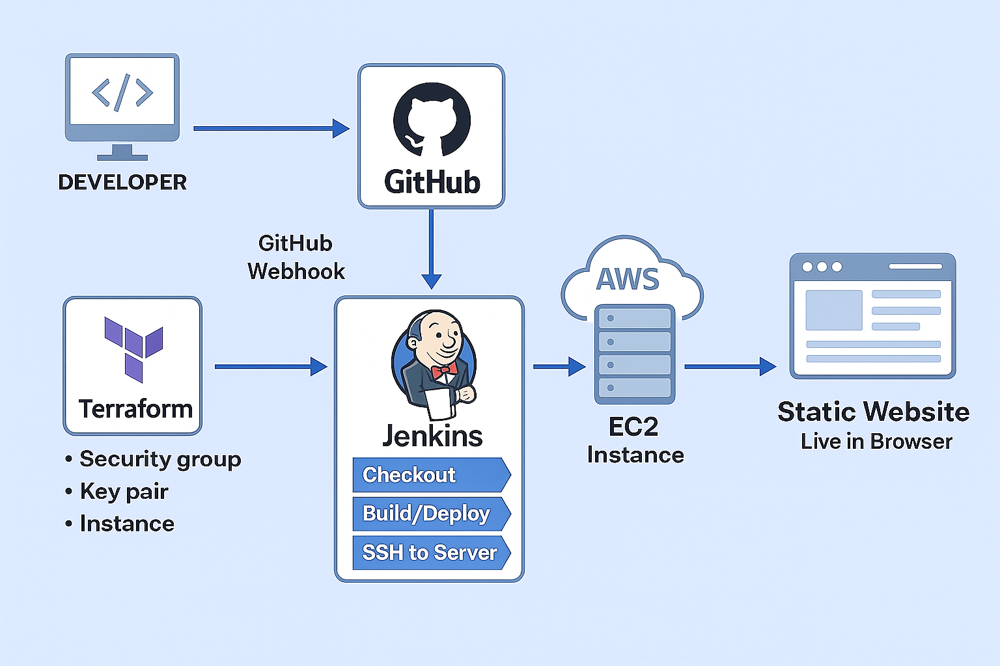

# 🚀 Static Website CI/CD Deployment using Terraform and Jenkins 

## 📘 Overview

This project demonstrates a fully automated CI/CD pipeline for deploying a static website to an AWS EC2 instance.
* **Terraform** provisions all AWS infrastructure
* **Nginx** hosts the static website
* **Jenkins** automates build & deployment
* **GitHub Webhooks** trigger automatic deployments on every push
---
### 🏗️ Architecture Diagram



---
<table border="1" cellspacing="0" cellpadding="8">
  <tr>
    <th>Technology</th>
    <th>Purpose</th>
  </tr>
  <tr>
    <td><b>Terraform</b></td>
    <td>Infrastructure as Code (IaC) to create EC2, Security SG, Key Pair, User Data</td>
  </tr>
  <tr>
    <td><b>AWS EC2</b></td>
    <td>Hosts the static website using Nginx</td>
  </tr>
  <tr>
    <td><b>Nginx</b></td>
    <td>Web server to serve static website</td>
  </tr>
  <tr>
    <td><b>Jenkins</b></td>
    <td>CI/CD automation server</td>
  </tr>
  <tr>
    <td><b>GitHub</b></td>
    <td>Code repository & webhook trigger</td>
  </tr>
  <tr>
    <td><b>SSH Agent</b></td>
    <td>Secure remote deployment to EC2</td>
  </tr>
  <tr>
    <td><b>GitHub Webhooks</b></td>
    <td>Triggers Jenkins pipeline automatically</td>
  </tr>
</table>

---
### 📁 1. Clone the Repository and Modify Files
Clone the static website project to your local system and make required modifications.

```
git clone https://github.com/aniketchougule108/static-website-project-terraform-jenkins.git
cd static-website-project
```
Modify HTML/CSS/JS files as per your UI changes.

.png)

---
### ⚙️ 2. Launch EC2 Instance using Terraform
Terraform configuration provisions:

✔ EC2 instance  
✔ Security Group (port 80 open)  
✔ Key Pair  
✔ User Data for Nginx setup  
✔ Git clone inside /usr/share/nginx/html

**Run Terraform** :
```
terraform init
terraform plan
terraform apply
```
After apply, Terraform will output the EC2 Public IP.

.png)

---
### 🛠️ 3. Jenkins Setup (Plugins + Credentials)
**✔ Install Plugins**
* Git Plugin
* ipeline Plugin
* SSH Agent Plugin
* GitHub Integration Plugin

**Add Credentials**

Navigate to :
```
Jenkins Dashboard → Manage Jenkins → Credentials → Global
```
Add:

* SSH Private Key (for EC2 deployment)
* GitHub token (optional)

---
### 📄 4. Add Jenkinsfile and Push to GitHub
Create a Jenkinsfile in the root of your repository.  

Commit and push:

```
git add .
git commit -m "Added Jenkinsfile for CI/CD pipeline"
git push origin main
```
.png)

---

### 🔗 5. Configure GitHub Webhook
Go to your GitHub repository:
```
Settings → Webhooks → Add Webhook
```
Enter:

* Payload URL: `http://<your-jenkins-ip>:8080/github-webhook/`
* Content type: `application/json`
* Trigger: "Just the push event"

.png)

---
### 🏃 6. Jenkins Build Process (Pipeline Flow)

Once the webhook triggers:  
1. Jenkins pulls latest code
2. SSH into EC2 instance
3. Navigates to web root directory
4. Performs `git pull` to update static files
5. Restarts Nginx
6. Confirms successful deployment

You will see the output in Jenkins Console Logs.

.png)

---
### 🌍 7. Access Your Application
After successful deployment, open browser:
```
http://<EC2_PUBLIC_IP>
```
Your static website will load successfully.

.png)

.png)

---
### 💡 Benefits of This Architecture
**🚀 Automatic Deployment**  
No manual updates. Every push auto-deploys.

**📦 Full Infrastructure as Code**  
Terraform ensures reproducible, trackable, and consistent AWS resources.

**🛡️ Secure Deployment**  
SSH Agent plugin safely handles private keys.

**⏱️ Faster Development Cycle** 
Immediate testing after each code update.

**🧰 Easy to Maintain**   
Simple codebase, no complex backend.

---
### 🧭 Conclusion

This project demonstrates a complete CI/CD pipeline using:

✔ Terraform for AWS provisioning  
✔ Jenkins for automation  
✔ GitHub for source control  
✔ Webhooks for continuous deployment

It provides a scalable, automated, and production-ready pipeline to deliver static websites efficiently and consistently.